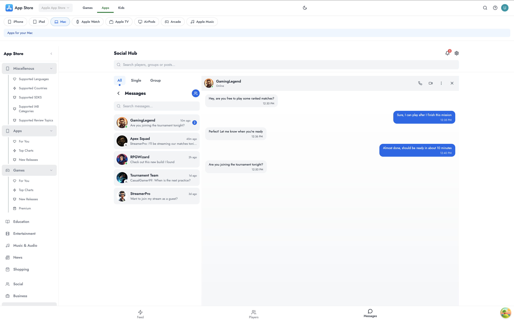

# Project setup && Envirinmental Setup

for this project we're going to be making use of

- REACT JS
- NODE JS
- FIREBASE AS A SERVICE
- TAILWIND FOR STYLES
- MATERIAL-UI FOR SOME EASY COMPONENTS

<!-- Video Overview Start -->
<!-- Replace YouTube embed with local video -->
<video width="640" controls>
  <source src="./presentation/appstore.mp4" type="video/mp4">
  Your browser does not support the video tag.
</video>
<!-- Video Overview End -->

<!-- Images Grid Start -->
## App Screenshots

|  |  |  |
|----------------------------|----------------------------|----------------------------|
|  |  |  |
|  |  |  |

<br/>

## Resposiveness

|  |  |  |
|---------------------------|---------------------------|---------------------------|

### Theme

|  |  | 
|----------------------------------|----------------------------------|

<!-- Images Grid End -->

## Admin

|  |  |  |
|-------------------------------|-------------------------------|-------------------------------|

## Real-time communication

|  |  |  |
|---------------------------|---------------------------|---------------------------|

## version control
 we'll be using git and github

- #### Method One

- Open your terminal from VSCode.
- Initialize your Git repository:
  ```bash
  git init
  ```
- `git add` . to add all initialized files
- `git commit -m` "messege for your files"

- git push it'll automatically open github and ask for permisions
- note you''ll have to use git globar --username and --email for more privacy
  ```bash
  git config --global user.name "Your Name"
  git config --global user.email "your.email@example.com"
  ```

- then you've pushed your projects to github

# OR

Push your changes to GitHub. This assumes you have already created a repository on GitHub.

```bash
git remote add origin https://github.com/your-username/your-repository.git
git branch -M main  # You may need to use 'main' or 'master' depending on your default branch name
git push -u origin main  # Pushing to the 'main' branch, change it if your defaul
```

- #### method two
- create a token and rcreate a new repo inside git hub first
- git clone the repo with the token to added security

```bash
git clone https://{your created token}@github.com/{your username}/{your repo}.git
```

- open the clone repo in vscode and install react and other tools
- git add . && git commit -m "your message" && git push, to push your files
